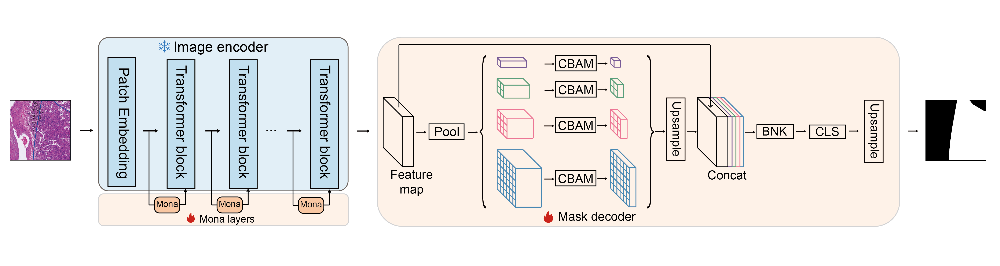

# **SAM-Lung: a specialized SAM architecture for precise tumor segmentation in lung cancer histopathology**

## Introduction
We present SAM-Lung, a weakly supervised segmentation framework that integrates the powerful encoder of the Segment Anything Model (SAM) with the pyramid pool module from PSPNet. This architecture leverages SAM’s global semantic representation capacity and PSPNet’s multi-scale contextual aggregation to enhance both global feature integration and boundary refinement. Meanwhile, the convolutional block attention module (CBAM) is introduced into PSPNet to further enhance the model's grasp of segmentation details. Furthermore, we employ the Mona parameter-efficient fine-tuning strategy to effectively adapt the pre-trained model to limited-annotation WSI datasets, mitigating overfitting while promoting local feature learning.
<p align="center">
  
</p>

## Installation
The code requires python>=3.8, as well as pytorch>=1.13.1 and torchvision>=0.14.1. Please follow the instructions [here](https://pytorch.org/get-started/locally/) to install both PyTorch and TorchVision dependencies. Installing both PyTorch and TorchVision with CUDA support is strongly recommended.
### Example conda environment create
```bash
conda env create -f environment.yml
```

## Getting Started
1. Download the [model checkpoint](https://github.com/facebookresearch/segment-anything?tab=readme-ov-file#model-checkpoints) and place it at e.g., SAM-Lung/checkpoint/sam_vit_b.pth
2. Place the data in the `data/` directory. Store the training images in the `train/mask` folder and the labels in the `train/label` folder; store the validation images in the `val/mask` folder and the labels in the `val/label` folder; store the test images in the `test/mask` folder and the labels in the `test/label` folder.
### Running the Code(Training on multiple GPUs)
```bash
### Main Arguments:
| Parameter       | Description                                                                   |
|-----------------|-------------------------------------------------------------------------------|
| `--data-path`   | Path to the dataset.                                                          |
| `--device`      | Device to be used for training (e.g., `cuda`).                                |
| `--num-classes` | Number of classes for the segmentation task (excluding the background class). |
| `--batch-size`  | Batch size per GPU.                                                           |
| `--epochs`      | Total number of epochs for training.                                          |
| `--lr`          | Learning rate for optimization.                                               |
| `--momentum`    | Momentum for the optimizer.                                                   |
| `--sync_bn`     | Whether to use synchronized batch normalization across multiple GPUs.         |
| `--output-dir`  | Directory where the model weights and logs will be saved.                     |
| `--resume`      | Path to resume training from a checkpoint.                                    |
| `--test-only`   | Flag to run only the test phase.                                              |
| `--distributed` | Flag to enable distributed training.                                          |
| `--world-size`  | Number of distributed processes to use.                                       |
| `--dist-url`    | URL used to set up distributed training.                                      |
| `--amp`         | Enable mixed precision training.                                              |

### Usage Example:
bash run.sh
```
### Test
```bash
python SAM-Lung/predict.py
```
